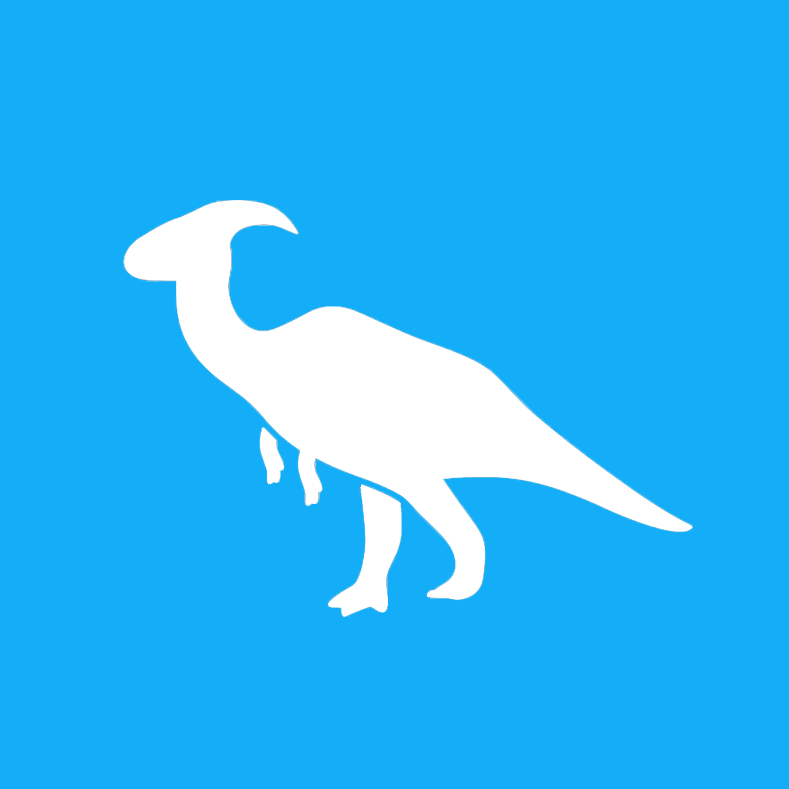

# Rawwr

<h1 align="center">
  
</h1>

Server side code which powers the Rawwr App. Written in C# using Dotnet 6.0

# Table of contents

- [Rawwr](#rawwr)
- [Table of contents](#table-of-contents)
- [What is Rawwr?](#what-is-rawwr)
- [How to run](#how-to-run)
- [About the logo](#about-the-logo)
- [Contributing](#contributing)
- [License](#license)

# What is Rawwr?

A twitter like app but more human and dinosaur friendly.

 

# How to run

Change `PostgresSettings` section in appsettings.json to match your dev environment.

execute `dotnet run` or run from your IDE.

 

# About the logo

The lovely dino in our logo in a Saurolophus. It's a hadrosaurid from late cretaceous period. Read more about Saurolophus [here.](https://en.wikipedia.org/wiki/Saurolophus)

psst, it is my favorite dinosaur 🦕

 

# Contributing

Your contributions are always welcome! Please have a look at the [contribution guidelines](CONTRIBUTING.md) first. :tada:

 

# License

The MIT License (MIT) 2022 - [Srihari Ayapilla](https://github.com/srihariash999/). Please have a look at the [LICENSE.md](LICENSE.md) for more details.

[(Back to top)](#table-of-contents)

 
 

